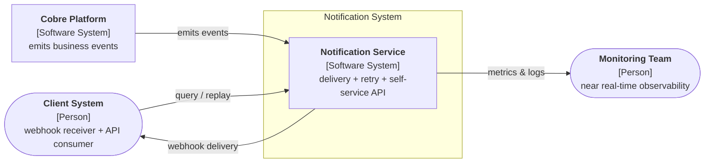
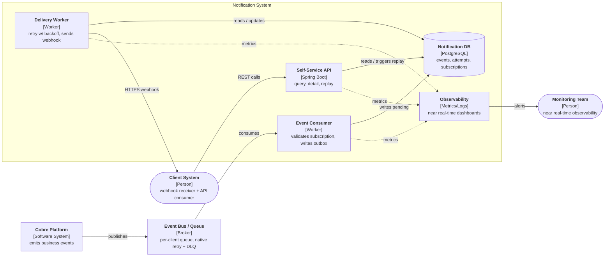
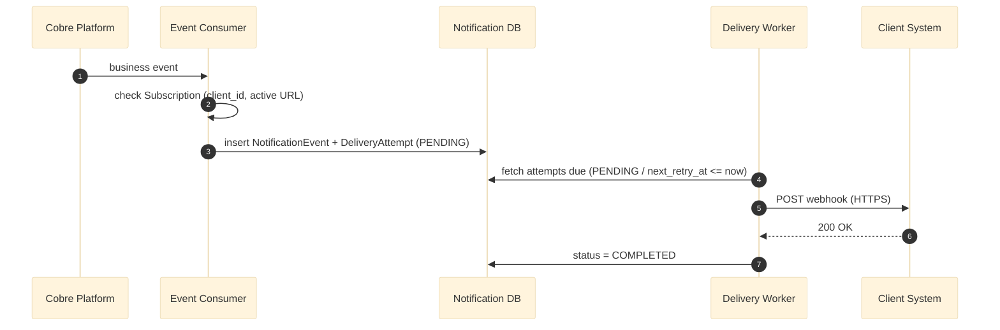
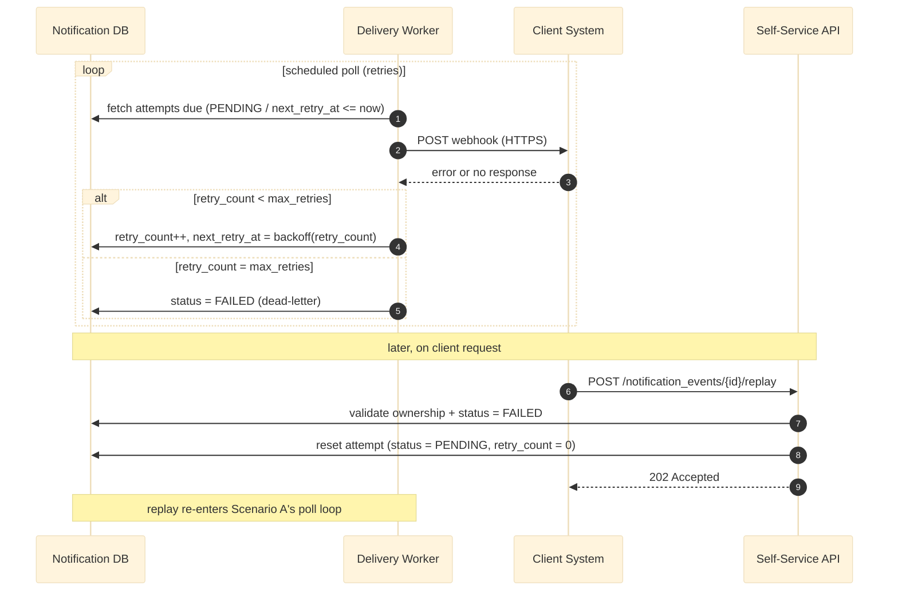
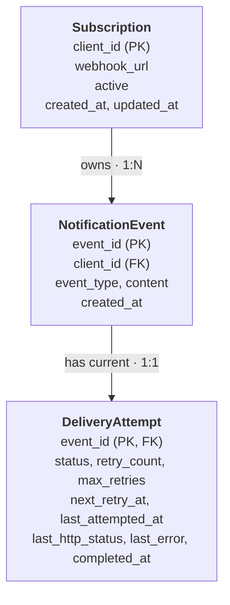

# DESIGN — Task 1: Solution Design

> Document under iterative construction. Planned structure:
> 1. Context (C4 level 1) ✅
> 2. Containers (C4 level 2) ✅
> 3. Delivery + retry sequence (step by step, with a narrated example) ✅
> 4. Data model ✅
> 5. Architecture decisions and trade-offs (scalability / resiliency) ← **under review**

---

## 1. Context (C4 — Level 1)

High-level view: who interacts with the notification system and which external systems are
involved. The "Notification System" is what we design/implement for this challenge; the
"Cobre Platform" (which generates the business events) is the upstream system, out of scope.

**Key points at this level:**
- The **Notification Service** is a consumer of Cobre platform events (it does not generate
  business events, it only receives and notifies about them).
- It has **two distinct output surfaces**: push to the client (webhook) and pull from the
  client (self-service API) — both over the same data (`NotificationEvent` /
  `DeliveryAttempt`).
- The monitoring team is a passive consumer of observability data, not a direct system
  participant.

---

## 2. Containers (C4 — Level 2)

This is the **target production design** for Task 1 — it favors scalability and resiliency
(managed broker, per-client queue with native DLQ retry, workers that scale independently).
The Task 2 implementation is a **deliberately simplified stand-in** for this design, built to
fit the challenge timebox (see the note under the diagram).

**Key points at this level:**
- **Event Consumer** and **Delivery Worker** are separate containers on purpose: ingestion
  (subscription check + persistence) and delivery (webhook + retry) have different load
  profiles and scale independently — a slow/failing client webhook must never block ingestion
  of new events for other clients.
- The **Event Bus / Queue** (e.g. EventBridge/SNS + one SQS queue per client, or a Kafka
  equivalent) is what gives retry and backpressure "for free" — visibility timeout handles
  retry, redrive policy handles the dead-letter path, independent of our own code.
- **Notification DB** is the single source of truth read by both the Delivery Worker and the
  Self-Service API — the `replay` endpoint doesn't re-deliver directly, it re-enqueues a new
  delivery attempt so it goes through the exact same retry/observability path as a normal
  delivery.
- **Observability** is a first-class container, not an afterthought — every worker and the API
  emit metrics/logs to it, satisfying the "near real-time" requirement from Task 1.

> **Challenge implementation note (Task 2):** given the timebox, Event Consumer + Delivery
> Worker + Self-Service API are implemented as **one Spring Boot application** (hexagonal
> architecture, so each stays a separate, independently-testable component internally), the
> Event Bus/Queue is replaced by a **DB-backed outbox table** polled on a schedule, and
> Observability is Spring Actuator + structured logs. This keeps the same ports/contracts as
> the target design above, so splitting them into separate deployables/adding a real broker
> later is a swap of adapters, not a redesign.

---

## 3. Delivery + retry sequence

Split into two diagrams — a combined one was too dense to read. Each one maps onto the
containers from Section 2 and is paired with a walkthrough using real seed data.

Each walkthrough below is numbered to match the diagram's own step numbers (①②③...), and
every "character" is the same component you see in the diagram box — so you can follow the
diagram with one finger and the story with the other and never lose your place:

| Story character | Diagram component |
|---|---|
| The Bank | `Cobre Platform` |
| The Clerk | `Event Consumer` |
| The Filing Cabinet | `Notification DB` |
| The Mail Carrier | `Delivery Worker` |
| You | `Client System` |
| The Post Office desk | `Self-Service API` (Scenario B only) |

### Scenario A — successful delivery (happy path)

Event `EVT001` — `credit_card_payment` for `CLIENT001` ("Credit card payment received for
$150.00").

**① → ⑦ — matches the 7 numbered arrows in the diagram above:**

1. **The Bank** (`Cobre Platform`) tells **the Clerk** (`Event Consumer`) something happened —
   a business event fires.
2. **The Clerk** checks the address book: "Is this really `CLIENT001`'s mailbox, and is it
   active?" (validates the `Subscription`) — yes, it matches. *(If it didn't match, the Clerk
   would just throw the letter away right here — no `DeliveryAttempt` is ever created for
   someone else's mail.)*
3. **The Clerk** writes the letter into **the Filing Cabinet** (`Notification DB`), stamped
   "waiting to be delivered" (`NotificationEvent` + `DeliveryAttempt` status `PENDING`).
4. **The Mail Carrier** (`Delivery Worker`) checks the Filing Cabinet on their rounds and picks
   up this letter (fetches attempts due).
5. **The Mail Carrier** walks over and knocks on **your** (`Client System`) door — the actual
   webhook `POST` over HTTPS.
6. **You** open the door: "Got it, thanks!" — the endpoint answers `200 OK`.
7. **The Mail Carrier** goes back and writes "delivered" in the Filing Cabinet — status set to
   `COMPLETED`. This is exactly what `GET /notification_events/EVT001` shows today.

### Scenario B — failure, retries, dead-letter, and manual replay

Event `EVT003` — `credit_transfer` for `CLIENT002` ("Bank transfer received from Account #4567
for $1,500.00"), already `failed` in the seed data. Picks up right after step 3 of Scenario A
(the `DeliveryAttempt` already exists as `PENDING`).

Same cast as Scenario A, plus **the Post Office desk** (`Self-Service API`).

**① → ⑨ — matches the 9 numbered arrows in the diagram above** (steps ④ and ⑤ are the two
*alternative* outcomes of a delivery attempt — only one of them happens each try):

1. **The Mail Carrier** (`Delivery Worker`) checks the Filing Cabinet and picks up the letter
   waiting for **you** (`CLIENT002`'s `PENDING` attempt from step 3 of Scenario A).
2. **The Mail Carrier** walks over and knocks on your door — `POST` to the webhook.
3. Nobody answers — the request times out or errors.
4. *If there are tries left:* the Carrier notes "try again later" and comes back after a bit —
   30 seconds, then 2 minutes, then 10 minutes, waiting longer each time
   (`retry_count++`, exponential backoff) — then loops back to step 2.
5. *Once the maximum number of tries is used up:* instead of trying again, the letter goes into
   the "couldn't deliver" bin (`status = FAILED`, dead-lettered). This is where `EVT003` sits
   right now.
6. Later, **you** notice it never arrived and call **the Post Office desk**
   (`Self-Service API`): `POST /notification_events/EVT003/replay`.
7. The desk checks it's really your letter and that it's actually sitting in the bin
   (ownership + `status = FAILED` check — see `SECURITY.md`).
8. The desk pulls it out of the bin and puts it back as "waiting to be delivered," resetting
   the tries counter to zero (`status = PENDING`, `retry_count = 0`).
9. The desk tells you "on it, we'll try again" (`202 Accepted`) — and the letter re-enters the
   **exact same** rounds as steps ① and ② above. No special-cased delivery path for replay.

---

## 4. Data model

Three entities: who to notify (`Subscription`), what happened (`NotificationEvent`), and how
delivery is going (`DeliveryAttempt`). `DeliveryAttempt` is kept **1:1 with the event** — replay
doesn't create a new row, it resets this one (see Scenario B, step 8) — which keeps
`GET /notification_events/{id}` trivial: one event, one current delivery state.

**Mapping from the seed data (`notification_events.json`):**

| Seed field | Maps to |
|---|---|
| `event_id` | `NotificationEvent.event_id` |
| `client_id` | `NotificationEvent.client_id` (→ `Subscription.client_id`) |
| `event_type`, `content` | `NotificationEvent.event_type`, `.content` |
| `delivery_date` | `NotificationEvent.created_at` — this is the **"event creation date"** the self-service API filters on (the seed field name is a bit misleading; it's the event's timestamp, not a delivery timestamp) |
| `delivery_status` | seeds the initial `DeliveryAttempt.status` (`completed` / `failed`) |

**Key points:**
- `status` is one of `PENDING`, `COMPLETED`, `FAILED` — this is exactly the `delivery_status`
  the self-service API filters and returns.
- `retry_count` / `max_retries` / `next_retry_at` are exactly what Scenario B's Delivery Worker
  reads and writes on every poll — no separate "retry" table needed for the MVP.
- `last_http_status` / `last_error` / `completed_at` are what satisfies the "store the final
  information related to the delivery" requirement from Task 1 — enough to answer "what
  actually happened" without a full audit log.
- `Subscription.webhook_url` is where the real destination URL goes once it's provided on
  presentation day — never hardcoded (see the note in Section 2's implementation callout).

> **Target design enhancement (not in Task 2):** at production scale, `DeliveryAttempt` would
> likely split into a 1:1 "current state" row (as above, for fast reads) plus a `DeliveryLog`
> table with one row **per actual HTTP try** (timestamp, status code, latency) for full audit
> history and richer observability dashboards. Skipped for the challenge timebox — the fields
> above already cover every functional requirement (retry, replay, self-service query).

---

## 5. Architecture decisions & trade-offs

### Key decisions

| Decision | Chosen | Alternative considered | Why |
|---|---|---|---|
| Overall approach | Ambitious target design (Sections 1–4) + simplified Task 2 implementation | Design and implementation as one identical system | The timebox is ~1.5 days; a real broker + multi-service deploy would cut into the time needed to get the 3 required REST endpoints and the security work right. Same ports/contracts either way, so nothing here is a dead end. |
| Code architecture | Hexagonal (ports & adapters) | Transaction-script / layered MVC | Required by Task 2, and it's exactly what makes "swap DB-outbox for a real broker later" a new adapter instead of a rewrite. |
| Event ingress (target) | Managed broker, one queue per client (e.g. EventBridge/SNS + SQS, or Kafka partitioned by client) | Single shared queue | Per-client queues mean one client's failures/slow consumer never delays another client's notifications — a direct answer to the "noisy neighbor" risk. |
| Event ingress (challenge build) | DB-backed outbox table + scheduled poll | Embed a broker (e.g. embedded Kafka) just for the demo | A broker adds real operational risk (start-up flakiness, extra containers) for no functional gain in a single-instance demo; the outbox pattern is itself a well-known resilient pattern, not a shortcut. |
| Retry strategy | Exponential backoff, capped `max_retries`, then dead-letter | Fixed interval retries / infinite retries | Fixed-interval retries can hammer a struggling client endpoint; infinite retries never free up capacity. Backoff + a hard stop (dead-letter) protects both sides and gives the client a clear, queryable failure state to act on via `/replay`. |
| Delivery record shape | `DeliveryAttempt` 1:1 with the event | Append-only log of every attempt | 1:1 keeps `GET /notification_events/{id}` a single trivial read and covers every functional requirement; a full per-try log is flagged as a target-design enhancement (Section 4), not required for the MVP. |
| Replay semantics | Reset the existing `DeliveryAttempt` to `PENDING` | Create a brand-new event/attempt row | Replay isn't a new business event — it's "try the same delivery again." Reusing the row keeps the event's identity and history in one place and reuses 100% of the normal delivery path (Scenario B, step 9). |

### Scalability

- **Independent scaling.** Event Consumer (ingestion) and Delivery Worker (webhook delivery)
  are separate components on purpose (Section 2) — a spike in incoming events never competes
  for the same capacity as a batch of slow/retrying webhook calls.
- **Safe concurrent polling.** The challenge implementation must support more than one
  Delivery Worker instance without double-delivering the same notification. The poll query
  uses row-level locking (`SELECT ... FOR UPDATE SKIP LOCKED` in Postgres) so two instances
  polling at the same time simply split the pending work instead of racing on it — this is
  what makes "add another instance" a valid scaling move even for the simplified build.
- **Per-client isolation (noisy neighbor).** One client with a consistently slow or down
  endpoint must not starve delivery capacity for every other client. In the target design this
  is free (separate queues per client); in the challenge build, the poll query is bounded per
  poll cycle and ordered so a single client's backlog can't monopolize a worker cycle.
- **Read scaling for the self-service API.** `GET /notification_events` is a read-heavy,
  filterable endpoint (by date + status) — in the target design this points at a read replica
  and is indexed on `(client_id, created_at, status)`, the exact filter combination Task 1
  requires.

### Resiliency

- **At-least-once delivery, by design.** A worker can crash between sending the webhook and
  recording `COMPLETED`. In that case the attempt is retried and the client may receive the
  same notification twice. This is called out explicitly rather than hidden: clients are
  expected to de-duplicate on `event_id` (included in every payload), which is the standard
  contract for webhook systems (Stripe, GitHub, etc. all work this way).
- **Crash-safety of the outbox.** Because state only ever advances (`PENDING → COMPLETED` or
  `PENDING → FAILED`) via a single row update after a real response is observed, a crash at any
  point just leaves the row `PENDING` for the next poll to pick up — no separate recovery
  process needed.
- **Dead-letter is a feature, not a failure.** `FAILED` is a deliberate, visible stop condition
  (queryable via `delivery_status=failed`, fixable via `/replay`) rather than an unbounded
  retry loop quietly consuming resources forever.
- **Security.** Full detail in [`SECURITY.md`](./SECURITY.md) — Broken Access Control (A01),
  Injection (A03), and SSRF (A10) are the three OWASP Top 10 risks most directly created by
  this design (multi-tenant data + an API that makes outbound HTTP calls to client-supplied
  URLs), each with a mitigation actually implemented in the Task 2 code.
- **Testing.** Unit tests cover the use cases/services, controllers, the webhook HTTP adapter
  (via WireMock, exercising timeout/5xx/success), and the backoff calculation as an isolated
  pure function. Integration tests (Testcontainers + a real Postgres) are a later-stage addition
  if time allows, layered on top of the same test suite rather than replacing it.

---

`DESIGN.md` (Task 1) is now complete end to end — Context → Containers → both delivery
sequences → data model → decisions. Next up: start the Task 2 implementation (Spring Boot,
hexagonal architecture, Postgres) and `SECURITY.md` (Task 3).
